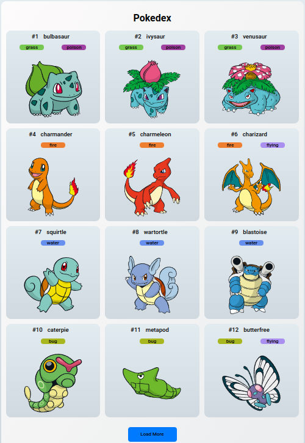

# Trilha JS Developer - Pokedex

## :books: Projeto

Este projeto é uma Pokedex, feito com HTML, CSS e Javascript, como requisito do desafio da DIO - Digital Innovation One
Os dados são consumidos da API do Pokemon, [Poke.co](https://pokeapi.co/).

## :computer: Tecnologias

- HTML
- CSS
- Javascript

## :clap: Créditos
- Video Aulas: [DIO](https://www.dio.me/)